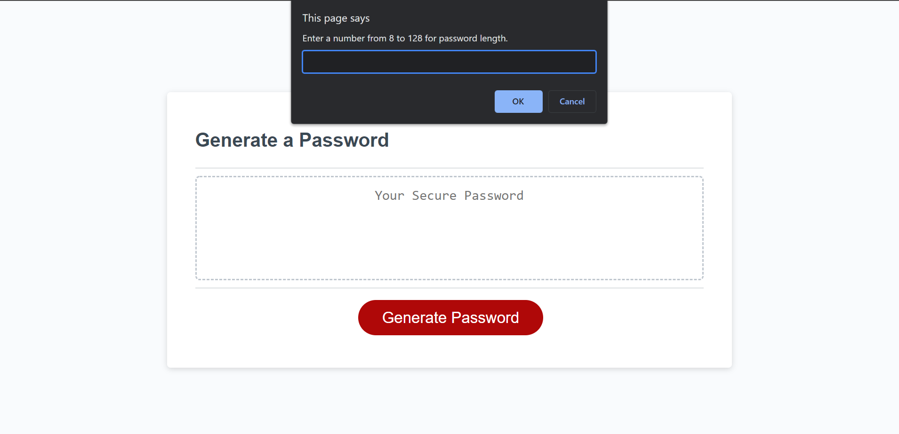

A password generator using javascript.

This password generator uses javascript and runs multiple variables that are inputed in functions in order to generate a random password depending on what options you picked at the window prompts. When you click the button on the website, you are prompted in a window to pick a number between 8 to 128 characters for a password you want generated. Then, you are prompted by 4 more windows whether or not you want to include uppercase, lower case, numbers, or special characters in your password. Finally, after picking all the criteria you want, a password is randomly generated for you.

Link to the deployed website: https://jaggedcomet.github.io/password-generator-marco/